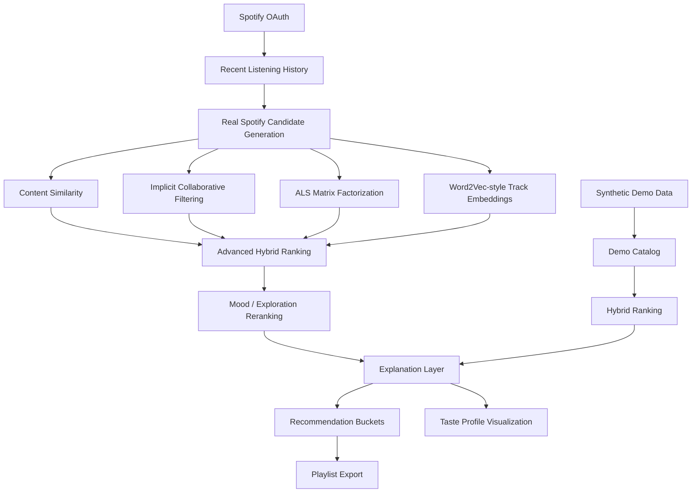
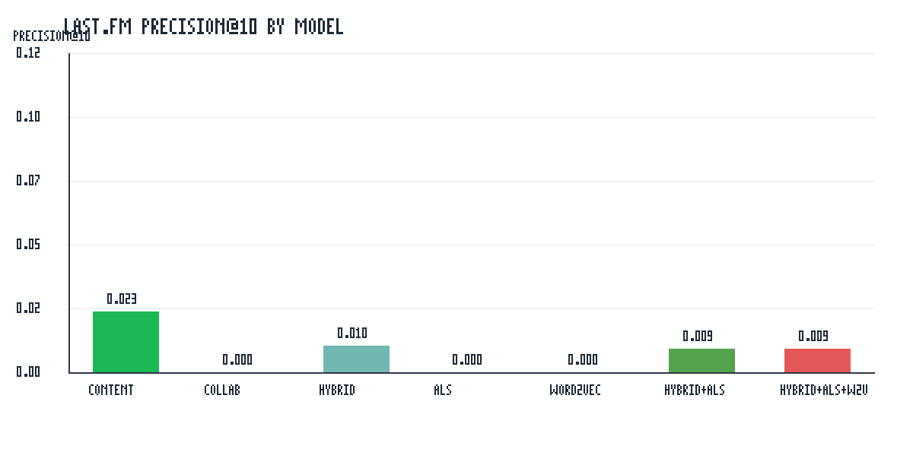
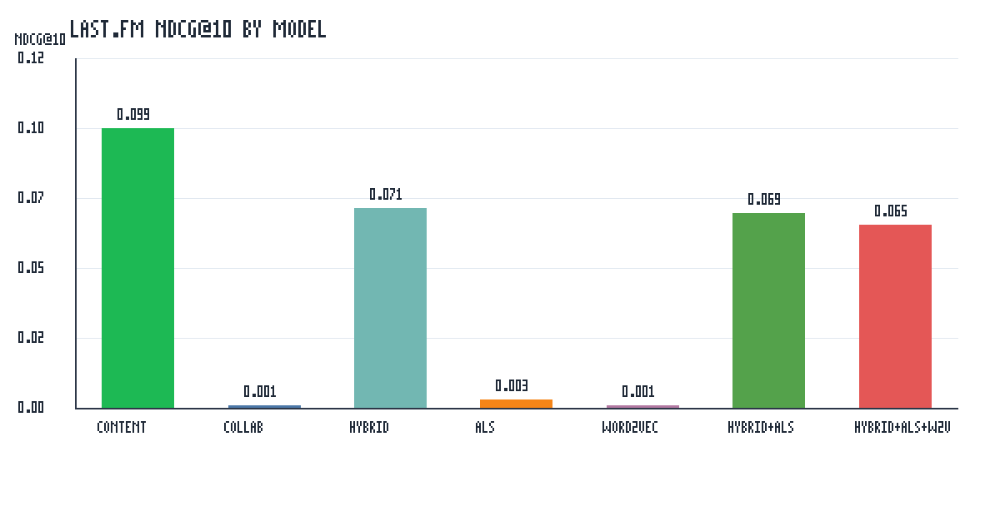

# Spotify-Style Music Discovery Platform

[]()
[]()
[]()
[]()
[]()

A Spotify-style music discovery platform that combines real Spotify listening history, hybrid recommendation, ALS matrix factorization, Word2Vec-style track embeddings, mood-aware reranking, and explainable recommendations in an interactive Streamlit app.

## What This Project Demonstrates

- Real Spotify OAuth authentication and recent-listening personalization
- Real Spotify candidate generation with graceful API fallback handling
- Hybrid recommendation stack combining content similarity, implicit collaborative filtering, ALS, Word2Vec-style embeddings, novelty, and discovery signals
- Mood and exploration-aware reranking for personalized music discovery
- Explainable recommendation chains and Spotify track links
- Offline evaluation with Precision@K, Recall@K, NDCG@K, diversity, and novelty metrics
- Synthetic fallback mode for deterministic demos

## Project Overview

This is an interview-ready Spotify-style music discovery platform built in Python. It combines Spotify OAuth login, real Spotify candidate generation, content-based similarity, implicit collaborative filtering, ALS matrix factorization, Word2Vec-style track embeddings, mood and exploration reranking, explainable recommendations, synthetic fallback mode, and offline evaluation on synthetic and Last.fm-style listening data.

The platform includes:

- Spotify OAuth login and recent listening history
- real Spotify candidate generation from recent artists, top tracks, and search
- synthetic demo mode for reproducible local demos without Spotify login
- content-based cosine similarity
- implicit collaborative filtering
- ALS collaborative filtering
- Word2Vec-style track-context embeddings using co-occurrence plus PPMI/SVD
- advanced hybrid ranking for optional ALS and embedding score blending
- mood and exploration controls
- familiar, discovery, and mood-based Spotify recommendation buckets
- explanation cards and recommendation-chain rationale
- synthetic and Last.fm offline evaluation

This is not a production-scale Spotify deployment. It is a portfolio project that emphasizes modular recommendation architecture, practical API handling, graceful fallback behavior, and honest evaluation.

## Key Features

- **Spotify login and recent listening history**: PKCE OAuth flow fetches the authenticated user's recent tracks.
- **Real Spotify candidate generation**: Spotify mode builds real-track candidates from recent artists, artist top tracks, and search.
- **Diversity-aware reranking**: Spotify mode deduplicates candidate versions, tracks artist concentration, and applies artist/source diversity before final truncation.
- **Control-sensitive ranking**: Exploration and ranking-focus controls use distinct Familiar, Discovery, Balanced, and Mood-first profiles so filter changes visibly reorder real Spotify recommendations.
- **Mood Dominance Calibration**: Mood-first and Mood-Based ranking treat mood as a ranking profile, not a small bonus, while Balanced keeps mood influence moderate.
- **v1.7 UI & Product Polish**: Compact Spotify-style recommendation cards, a Music Personality panel, playlist export preview, and cleaner preference-only demo controls.
- **Recommendation buckets**: Spotify mode can show familiar, discovery, and mood-based recommendation sections.
- **Spotify playlist export**: Real Spotify recommendations can be saved into a private Spotify playlist.
- **Taste profile visualization**: Spotify mode summarizes recent taste with a cluster label, top artists, top genres, and a 2D taste map.
- **Playlist preview and export**: Spotify mode previews mood, exploration, track count, available duration, and included buckets before saving a private playlist.
- **Streamlit UI**: The app is demoable locally with or without Spotify credentials.
- **Explainable recommendation chain**: Recommendation cards show rationale, source labels, Spotify links, and album art when available.
- **Mood-aware playlist generation**: Recommendations can be sequenced into an interpretable mood-aware playlist, using audio-feature mood profiles when available and metadata keyword fallback when unavailable.
- **Robust API fallback behavior**: Missing audio features, failed candidate sources, sparse history, or unavailable Spotify login do not crash the app.
- **Synthetic demo mode**: Built-in demo profiles and catalog keep the project reproducible.
- **Offline evaluation**: Synthetic and Last.fm-style evaluators report ranking metrics and dataset diagnostics.

## System Architecture



The Spotify path uses real listening history to generate real Spotify candidate tracks, then ranks them with content, collaborative, ALS, embedding, mood, novelty, and exploration signals. The synthetic path provides a deterministic fallback for demos without Spotify login. Taste profile visualization summarizes the current Spotify real-track session with dimensionality reduction and clustering. Playlist export is available only for real Spotify tracks when the OAuth token includes the required `playlist-modify-private` scope.

Important modules:

- `src/app/streamlit_app.py`: Streamlit app and UI orchestration.
- `src/auth/spotify_auth.py`: Spotify Authorization Code with PKCE.
- `src/services/user_profile_service.py`: Recent listening history normalization.
- `src/services/spotify_candidate_service.py`: Real Spotify candidate generation and bucketed recommendations.
- `src/services/diversity_reranking_service.py`: Diversity-aware final reranking for Spotify real-track candidates.
- `src/services/taste_profile_service.py`: Spotify taste profile summaries and 2D taste-map projections.
- `src/models/content_recommender.py`: Content-based cosine similarity.
- `src/models/collaborative_recommender.py`: Existing implicit collaborative filtering baseline.
- `src/models/als_recommender.py`: Lightweight implicit-feedback ALS.
- `src/models/track_embedding_model.py`: Word2Vec-style track-context embeddings.
- `src/services/advanced_hybrid_ranking_service.py`: Optional hybrid + ALS + embedding score blending.
- `src/evaluation/offline_evaluator.py`: Synthetic offline evaluation.
- `src/evaluation/lastfm_offline_evaluator.py`: Last.fm-style offline evaluation and report generation.

## Portfolio Summary

**Spotify-Style Music Discovery Platform | Python, Streamlit, Spotify API, Machine Learning**

- Built a Spotify-style music discovery platform combining content-based similarity, implicit collaborative filtering, ALS matrix factorization, Word2Vec-style track embeddings, novelty, and discovery signals.
- Integrated Spotify OAuth and real Spotify candidate generation to personalize recommendations from recent listening history while preserving synthetic fallback mode.
- Evaluated recommendation quality using Precision@K, Recall@K, NDCG@K, diversity, and novelty metrics across synthetic and Last.fm-style benchmarks.

## GitHub Repository Metadata

Recommended GitHub About description:

```text
Spotify-style music discovery platform with Spotify OAuth, real-track recommendations, ALS, Word2Vec-style embeddings, explainable ranking, and offline evaluation.
```

Recommended GitHub topics:

```text
python, machine-learning, data-science, recommendation-system, recommender-systems, spotify, spotify-api, streamlit, music-recommendation, hybrid-recommender, collaborative-filtering, content-based-filtering, als, word2vec, offline-evaluation
```

The Website field can stay blank until the Streamlit demo is deployed. This repository should be pinned on the GitHub profile.

## Evaluation

The project reports ranking quality with:

- Precision@K
- Recall@K
- NDCG@K

It also includes beyond-accuracy utilities for:

- diversity
- novelty
- coverage
- popularity bias

Reports:

- [`evaluation_report.md`](evaluation_report.md): synthetic evaluation.
- [`evaluation_report_lastfm.md`](evaluation_report_lastfm.md): Last.fm-style evaluation, coverage, density, and interpretation.

## Evaluation Highlights





Current benchmark interpretation:

- Content-only currently performs strongest in the reported synthetic and Last.fm benchmark settings.
- ALS and Word2Vec-style models are implemented and evaluated, but they do not outperform content-only on the current benchmark settings.
- This is likely due to dataset sparsity, limited user-item overlap, and the candidate-aware Last.fm benchmark.
- The advanced hybrid stack remains useful because production-style music discovery typically combines relevance, familiarity, novelty, and exploration signals.
- Last.fm evaluation uses a practical candidate-aware benchmark, not full exhaustive retrieval over every catalog track.

## Demo Screenshots

Coming soon:

- Spotify login
- Recommendation buckets
- Playlist export success

## How To Run Locally

```bash
python3 -m venv .venv
source .venv/bin/activate
pip install -e ".[dev]"
pytest -q
streamlit run src/app/streamlit_app.py
```

Optional compile check:

```bash
python -m compileall src tests
```

Synthetic evaluation:

```bash
PYTHONPATH=src python -c "from evaluation.offline_evaluator import run_demo_offline_evaluation; result = run_demo_offline_evaluation(k=3, holdout_count=1); print(result.comparison_table.to_string(index=False))"
```

Synthetic weight tuning:

```bash
PYTHONPATH=src python -c "from evaluation.weight_tuning import run_demo_weight_tuning; result = run_demo_weight_tuning(k=3, holdout_count=1); print(result.tuning_table.to_string(index=False))"
```

Last.fm evaluation:

```bash
PYTHONPATH=src python -c "from evaluation.lastfm_offline_evaluator import run_lastfm_offline_evaluation; result = run_lastfm_offline_evaluation('data/processed/lastfm_interactions.csv', 'data/processed/lastfm_catalog.csv', k=10, min_user_interactions=5, holdout_count=1); print(result.comparison_table.to_string(index=False))"
```

## Environment Variables

Create a repo-root `.env` from `.env.example`.

```env
SPOTIFY_CLIENT_ID=your_spotify_client_id
SPOTIFY_CLIENT_SECRET=your_spotify_client_secret
SPOTIFY_REDIRECT_URI=http://localhost:8501/callback
SPOTIFY_OAUTH_SCOPES=user-read-recently-played playlist-modify-private
SPOTIFY_API_BASE_URL=https://api.spotify.com/v1
SPOTIFY_ACCOUNTS_BASE_URL=https://accounts.spotify.com
SPOTIFY_REQUEST_TIMEOUT_SECONDS=30
SPOTIFY_DEFAULT_MARKET=US
```

The Streamlit login flow needs `SPOTIFY_CLIENT_ID`, `SPOTIFY_REDIRECT_URI`, and `SPOTIFY_OAUTH_SCOPES`. `playlist-modify-private` is required only for saving real Spotify recommendations into a private Spotify playlist. Users who only keep `user-read-recently-played` can still log in and receive recommendations, but playlist export will show a re-login instruction. `SPOTIFY_CLIENT_SECRET` is used by client-credentials collection workflows and is kept in `.env.example` as a placeholder only.

## Spotify Setup

1. Create an app in the Spotify Developer Dashboard.
2. Add this redirect URI to the Spotify app settings:

   ```text
   http://localhost:8501/callback
   ```

3. Put the same redirect URI in `.env`.
4. If the Spotify app is in development mode, add your Spotify account as an allowlisted user.
5. Use `user-read-recently-played` for recommendation personalization.
6. Add `playlist-modify-private` if you want to save recommendations into a private Spotify playlist.

Spotify may deny or omit some metadata endpoints, especially audio features in some user-scoped flows. The app handles this by falling back to metadata-only ranking and compact user-facing warnings.

Playlist export creates private playlists by default and requires `playlist-modify-private`.

## Data

Large data files are not committed.

- Place raw Last.fm files under `data/raw/`.
- Generate processed interaction and catalog files under `data/processed/`.
- Synthetic demo data is included in source code for reproducibility.
- `.gitignore` excludes raw data, processed data, CSV/TSV/parquet/pickle files, and local generated artifacts.

## Limitations

- This is a portfolio-grade prototype, not a production-scale Spotify discovery service.
- Spotify API availability can vary by account, token scope, market, and endpoint.
- Audio features may be unavailable; the app falls back safely.
- ALS and Word2Vec-style embeddings need richer interaction overlap and longer listening sequences to outperform simpler content baselines.
- Last.fm evaluation uses a candidate-aware benchmark for local practicality, not full exhaustive retrieval.
- Spotify playlist export is private-playlist only in this prototype.

## Release

### v1.0 — Portfolio-ready Spotify-Style Music Discovery Platform

Initial portfolio-ready release featuring Spotify OAuth, real Spotify candidate generation, hybrid ranking, ALS, Word2Vec-style embeddings, Streamlit UI, explanation layer, and offline evaluation reports.

### v1.1 progress — Recommendation Buckets

Recommendation Buckets are implemented for Spotify real-track mode:

- Familiar Picks prioritize recent artists, top-track candidates, and popularity.
- Discovery Picks prioritize novelty, search-discovered candidates, and artist variety.
- Mood-Based Picks prioritize the selected mood using audio features when available, with metadata-only fallback.

Playlist export is added in v1.2 for private Spotify playlists.

### v1.2 progress — Spotify Playlist Export

Spotify Playlist Export is implemented for real Spotify recommendation mode:

- Users can save real Spotify recommendations into a private Spotify playlist.
- The playlist description includes mood, exploration level, generation timestamp, and source metadata.
- Bucket recommendations can be exported with duplicates removed before tracks are added.

### v1.4 progress — Taste Profile Visualization

Taste Profile Visualization is implemented for Spotify real-track mode:

- Uses dimensionality reduction and clustering to summarize recent listening taste.
- Shows a cluster label, top artists, top genres when available, and a compact 2D taste map.
- Falls back safely when UMAP or richer metadata is unavailable.

## Roadmap

### v1.1/v1.2 — Playlist Export + Recommendation Bucket Polish

Goal:
Make the demo feel like a real product.

Planned work:

1. Spotify Playlist Creation

- Implemented OAuth scope:
  - `playlist-modify-private`
- Implemented Spotify API methods:
  - `create_playlist`
  - `add_tracks_to_playlist`
- Implemented UI button:
  - Save recommendations to Spotify
- Implemented playlist description metadata:
  - mood
  - exploration level
  - generated timestamp

2. Recommendation Buckets

- Implemented UI sections:
  - Familiar
  - Discovery
  - Mood-Based
- Continue polishing mood/exploration contrast as more candidate data becomes available
- Keep short rationale for each bucket

3. Tests

- Test playlist API client methods with mocked requests
- Test bucket ranking outputs differ by bucket and controls
- Test UI-safe fallback if playlist creation fails

4. README / Demo polish

- Add screenshots or GIF if available
- Add architecture diagram and evaluation charts

## Suggested GitHub Issues

- v1.2: Polish Spotify playlist export flow
- v1.1: Polish Familiar / Discovery / Mood-Based recommendation buckets
- Add architecture diagram and evaluation charts to README
- Deploy Streamlit demo

## Development Plan

Suggested next branch:

```bash
git checkout -b feature/v1.2-playlist-export
```

Suggested future commits:

- Polish Spotify playlist export UI
- Polish recommendation bucket ranking
- Update README for v1.2

## Future Work

- Public playlist export support.
- Stronger real-world evaluation with sampled negatives and full-catalog retrieval experiments.
- Better listening-session construction and session-aware sequence modeling.
- Experiment tracking for model settings and evaluation runs.
- Deployment setup for a hosted Streamlit demo.
- More polished UMAP/k-means taste-cluster analysis and visual reporting.

## Repo Hygiene Notes

Before committing, make sure generated caches, local data, `.env`, and `.venv/` are not staged. The project is designed so source, tests, reports, notebooks, and lightweight documentation can be committed while large datasets remain local.
