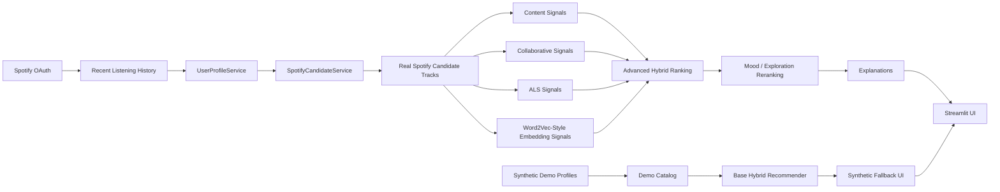

# Spotify-Style Music Discovery Platform

## Project Overview

This is an interview-ready Spotify-style music discovery platform built in Python. It combines Spotify OAuth login, real Spotify candidate generation, content-based similarity, implicit collaborative filtering, ALS matrix factorization, Word2Vec-style track embeddings, mood and exploration reranking, explainable recommendations, synthetic fallback mode, and offline evaluation on synthetic and Last.fm-style listening data.

The platform includes:

- Spotify OAuth login and recent listening history
- real Spotify candidate generation from recent artists, top tracks, and search
- synthetic demo mode for reproducible local demos without Spotify login
- content-based cosine similarity
- implicit collaborative filtering
- ALS collaborative filtering
- Word2Vec-style track-context embeddings using co-occurrence plus PPMI/SVD
- advanced hybrid ranking for optional ALS and embedding score blending
- mood and exploration controls
- familiar, discovery, and mood-based Spotify recommendation buckets
- explanation cards and recommendation-chain rationale
- synthetic and Last.fm offline evaluation

This is not a production-scale Spotify deployment. It is a portfolio project that emphasizes modular recommendation architecture, practical API handling, graceful fallback behavior, and honest evaluation.

## Key Features

- **Spotify login and recent listening history**: PKCE OAuth flow fetches the authenticated user's recent tracks.
- **Real Spotify candidate generation**: Spotify mode builds real-track candidates from recent artists, artist top tracks, and search.
- **Recommendation buckets**: Spotify mode can show familiar, discovery, and mood-based recommendation sections.
- **Streamlit UI**: The app is demoable locally with or without Spotify credentials.
- **Explainable recommendation chain**: Recommendation cards show rationale, source labels, Spotify links, and album art when available.
- **Mood-aware playlist generation**: Recommendations can be sequenced into an interpretable mood-aware playlist.
- **Robust API fallback behavior**: Missing audio features, failed candidate sources, sparse history, or unavailable Spotify login do not crash the app.
- **Synthetic demo mode**: Built-in demo profiles and catalog keep the project reproducible.
- **Offline evaluation**: Synthetic and Last.fm-style evaluators report ranking metrics and dataset diagnostics.

## Architecture



Important modules:

- `src/app/streamlit_app.py`: Streamlit app and UI orchestration.
- `src/auth/spotify_auth.py`: Spotify Authorization Code with PKCE.
- `src/services/user_profile_service.py`: Recent listening history normalization.
- `src/services/spotify_candidate_service.py`: Real Spotify candidate generation and bucketed recommendations.
- `src/models/content_recommender.py`: Content-based cosine similarity.
- `src/models/collaborative_recommender.py`: Existing implicit collaborative filtering baseline.
- `src/models/als_recommender.py`: Lightweight implicit-feedback ALS.
- `src/models/track_embedding_model.py`: Word2Vec-style track-context embeddings.
- `src/services/advanced_hybrid_ranking_service.py`: Optional hybrid + ALS + embedding score blending.
- `src/evaluation/offline_evaluator.py`: Synthetic offline evaluation.
- `src/evaluation/lastfm_offline_evaluator.py`: Last.fm-style offline evaluation and report generation.

## Portfolio Summary

**Spotify-Style Music Discovery Platform | Python, Streamlit, Spotify API, Machine Learning**

- Built a Spotify-style music discovery platform combining content-based similarity, implicit collaborative filtering, ALS matrix factorization, Word2Vec-style track embeddings, novelty, and discovery signals.
- Integrated Spotify OAuth and real Spotify candidate generation to personalize recommendations from recent listening history while preserving synthetic fallback mode.
- Evaluated recommendation quality using Precision@K, Recall@K, NDCG@K, diversity, and novelty metrics across synthetic and Last.fm-style benchmarks.

## Evaluation

The project reports ranking quality with:

- Precision@K
- Recall@K
- NDCG@K

It also includes beyond-accuracy utilities for:

- diversity
- novelty
- coverage
- popularity bias

Reports:

- [`evaluation_report.md`](evaluation_report.md): synthetic evaluation.
- [`evaluation_report_lastfm.md`](evaluation_report_lastfm.md): Last.fm-style evaluation, coverage, density, and interpretation.

Current benchmark interpretation:

- Content-only currently performs strongest in the reported synthetic and Last.fm benchmark settings.
- ALS and Word2Vec-style models are implemented and evaluated, but they do not outperform content-only on the current benchmark settings.
- This is expected: collaborative and embedding models need richer user-item overlap and stronger sequence/co-occurrence structure to shine.
- Last.fm evaluation uses a practical candidate-aware benchmark, not full exhaustive retrieval over every catalog track.

## How To Run Locally

```bash
python3 -m venv .venv
source .venv/bin/activate
pip install -e ".[dev]"
pytest -q
streamlit run src/app/streamlit_app.py
```

Optional compile check:

```bash
python -m compileall src tests
```

Synthetic evaluation:

```bash
PYTHONPATH=src python -c "from evaluation.offline_evaluator import run_demo_offline_evaluation; result = run_demo_offline_evaluation(k=3, holdout_count=1); print(result.comparison_table.to_string(index=False))"
```

Last.fm evaluation:

```bash
PYTHONPATH=src python -c "from evaluation.lastfm_offline_evaluator import run_lastfm_offline_evaluation; result = run_lastfm_offline_evaluation('data/processed/lastfm_interactions.csv', 'data/processed/lastfm_catalog.csv', k=10, min_user_interactions=5, holdout_count=1); print(result.comparison_table.to_string(index=False))"
```

## Environment Variables

Create a repo-root `.env` from `.env.example`.

```env
SPOTIFY_CLIENT_ID=your_spotify_client_id
SPOTIFY_CLIENT_SECRET=your_spotify_client_secret
SPOTIFY_REDIRECT_URI=http://localhost:8501/callback
SPOTIFY_OAUTH_SCOPES=user-read-recently-played
SPOTIFY_API_BASE_URL=https://api.spotify.com/v1
SPOTIFY_ACCOUNTS_BASE_URL=https://accounts.spotify.com
SPOTIFY_REQUEST_TIMEOUT_SECONDS=30
SPOTIFY_DEFAULT_MARKET=US
```

The Streamlit login flow needs `SPOTIFY_CLIENT_ID`, `SPOTIFY_REDIRECT_URI`, and `SPOTIFY_OAUTH_SCOPES`. `SPOTIFY_CLIENT_SECRET` is used by client-credentials collection workflows and is kept in `.env.example` as a placeholder only.

## Spotify Setup

1. Create an app in the Spotify Developer Dashboard.
2. Add this redirect URI to the Spotify app settings:

   ```text
   http://localhost:8501/callback
   ```

3. Put the same redirect URI in `.env`.
4. If the Spotify app is in development mode, add your Spotify account as an allowlisted user.
5. Use `user-read-recently-played` as the required OAuth scope.

Spotify may deny or omit some metadata endpoints, especially audio features in some user-scoped flows. The app handles this by falling back to metadata-only ranking and compact user-facing warnings.

Playlist writeback is not implemented. If future work adds Spotify playlist creation, the app will need playlist write scopes such as `playlist-modify-private` or `playlist-modify-public`.

## Data

Large data files are not committed.

- Place raw Last.fm files under `data/raw/`.
- Generate processed interaction and catalog files under `data/processed/`.
- Synthetic demo data is included in source code for reproducibility.
- `.gitignore` excludes raw data, processed data, CSV/TSV/parquet/pickle files, and local generated artifacts.

## Limitations

- This is a portfolio-grade prototype, not a production-scale Spotify discovery service.
- Spotify API availability can vary by account, token scope, market, and endpoint.
- Audio features may be unavailable; the app falls back safely.
- ALS and Word2Vec-style embeddings need richer interaction overlap and longer listening sequences to outperform simpler content baselines.
- Last.fm evaluation uses a candidate-aware benchmark for local practicality, not full exhaustive retrieval.
- Spotify playlist creation/writeback is future work.

## Future Work

- Spotify playlist creation/writeback.
- Stronger real-world evaluation with sampled negatives and full-catalog retrieval experiments.
- Better listening-session construction and session-aware sequence modeling.
- Experiment tracking for model settings and evaluation runs.
- Deployment setup for a hosted Streamlit demo.
- More polished UMAP/k-means taste-cluster analysis and visual reporting.

## Repo Hygiene Notes

Before committing, make sure generated caches, local data, `.env`, and `.venv/` are not staged. The project is designed so source, tests, reports, notebooks, and lightweight documentation can be committed while large datasets remain local.
